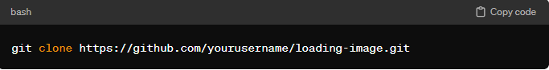
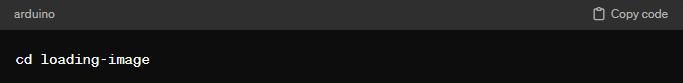
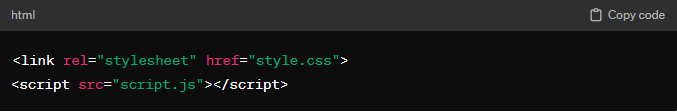
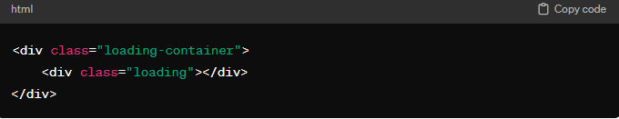

# Loading-Image
<b>Creating a Loading Image with HTML, CSS, and JavaScript</b>  
This project demonstrates how to create a simple loading image using HTML, CSS, and JavaScript. This loading image can be used to indicate to users that content is being loaded or processed in the background. 
<b>Usage</b> 
Follow these steps to use the loading image in your project: 
1. <b>Clone Repository:</b> 
Clone this repository to your local machine using the following command: 
  
2. <b>Navigate to Directory:</b> 
Change directory to the project folder:
 
3. <b>Open Files:</b> 
 Open <i>index.html</i>, <i>style.css</i>, and <i>script.js</i> files in your preferred code editor. 
4. <b>Copy Code:</b> 
 Copy the code from these files into your own project, or modify them as needed. 
5. <b>Include Files:</b> 
 Make sure to include the <i>style.css</i> and <i>script.js</i> files in your HTML file: 
  
6. <b>Add HTML: </b> 
Add the HTML structure for the loading image where you want it to appear in your project 
  
7. <b>Style:</b> 
Customize the appearance of the loading image by modifying the CSS in <i>style.css</i> file. 
8. <b>JavaScript:</b> 
Adjust the behavior of the loading image by modifying the JavaScript in <i>script.js</i> file. 
9.<b>Test: </b> 
Test the loading image in your project to ensure it works as expected. 
<b>Contributors</b> 
👩‍🦰 KANKANA PANDIT 
<b>License</b> 
This project is licensed under the MIT License - see the LICENSE file for details. 
<b>Support</b> 
For any questions or issues, please open an issue on GitHub.

